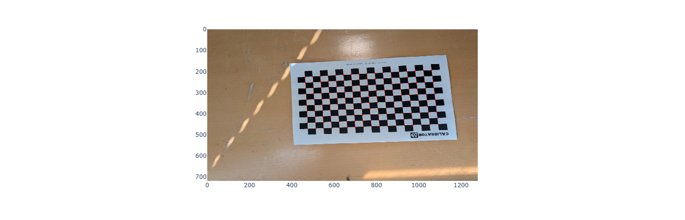
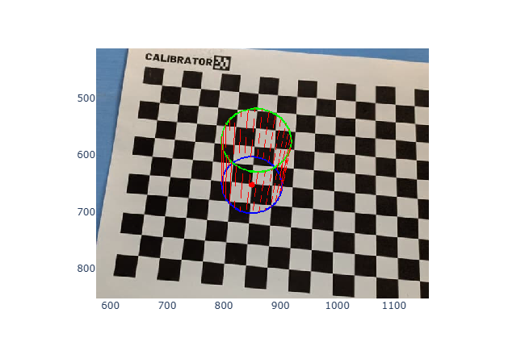
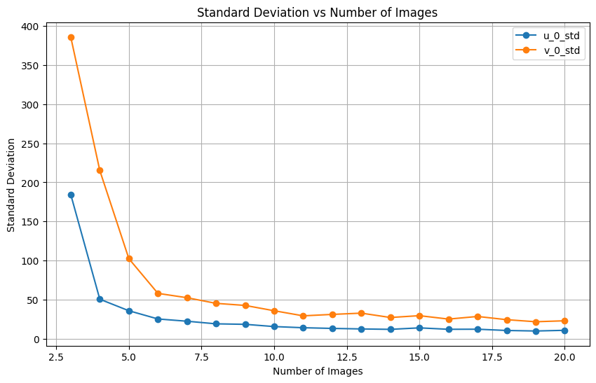
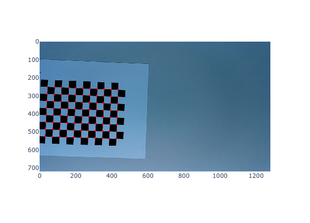

# Computer Vision and Pattern Recognition Project

## Lorenzo Cusin – Giacomo Serafini – Pietro Terribile

## Project 1 — Camera Calibration

### Introduction

The **camera calibration problem** consists in estimating the intrinsic and extrinsic parameters of a camera through several measurements.  
The outcome of these calculations is the **Perspective Projection Matrix** \( $P$ \), which can be written as:

$$P = K [ R | t ]$$

Here:

- **\( $K$ \)** is the intrinsic matrix, containing the internal parameters of the camera (specific to the camera itself)
- **\( $R$ \)** and **\( $t$ \)** are respectively the rotation matrix and the translation vector, describing the camera pose

??(SERVE SPECIFICARE? mi sembra molto una frase da GPT)Once that these parameters are found, many computer vision tasks can be performed, such as **Triangulation**, **Structure from motion**, **Camera pose**, **Stereoscopy** and many other.

### Task 1 - Zhang's Calibration method

It is required to calibrate the camera (thus finding the unique K and the pair $[R | t]$ for each image) by using the Zhang's procedure, which is based on a key principle: instead of using a single image of many non-coplanar points (??(NON CAPISCO SIGNIFICATO FRASE. intendi tipo "e.g: DLT method"?)as is necessary for Direct Linear Transform, or DLT, methods), Zhang's approach requires multiple images (at least three) of a simple planar calibration pattern.

In our case we are provided with 81 images of a checkerboard, where each image is taken from a different point in the World reference frame. 
The foundation of Zhang's method relies on establishing a mathematical relationship, known as a **homography** ($H$), between the known 3D plane in the scene and its 2D perspective projection onto the image plane.  
First of all, we needed to import `numpy` and `OpenCV` libraries to our code. Then we followed the **LabLecture_1** steps to find the keypoints between the given images. We defined a function `get_corners` in which we utilized the function `findChessboardCorners` from the OpenCV library, in order to get the corresponcences we needed to estimate the **homography**.

The function `get_corners` is then called inside another function: `get_homography`. This function is used to compute the homography matrix $H$ that allows us to map 3D points on a calibration pattern (the checkerboard) to 2D pixel coordinates in an image. It implements the Direct Linear Transform (DLT) algorithm, which is the first fundamental step in Zhang’s calibration procedure:

- It first calls `get_corners` to detect the $(u, v)$ pixel coordinates of the checkerboard corners in the provided image
- It generates the corresponding world coordinates $(x, y)$ in millimeters by multiplying the grid indices by the `square_size` (11mm in our case). It assumes the board lies on the $Z=0$ plane
- It builds a system of linear equations: $Ah = 0$. Each detected corner contributes two rows to the matrix $A$, ??(NON CAPISCO SIGNIFICATO FRASE)representing the relationship:

$$
\begin{bmatrix}
x & y & 1 & 0 & 0 & 0 & -ux & -uy & -u \\
0 & 0 & 0 & x & y & 1 & -vx & -vy & -v
\end{bmatrix}
$$

- SVD Solver: It uses Singular Value Decomposition to solve the system. The homography parameters are found in the last row of the $V$ matrix (the right-singular vector associated with the smallest singular value)
- Output: The resulting 9-element vector is reshaped into the final 3x3 Homography matrix

Another function, called `get_v_vector`, is used to linearize the constraints that the homography $H$ imposes, ??(NON CAPISCO SOGGETTO)represented by the symmetric matrix $B = K^{-T}K^{-1}$. Since $B$ is symmetric, ??(E' UNA CONSEGUENZA?)it is defined by 6 elements collected in a vector $b$. The function extracts specific products from two columns of the homography matrix ($h_i$ and $h_j$) so that the constraint $h_i^T B h_j$ can be written as the dot product $v_{ij}^T b$. Each homography provides constraints that are stacked into a system of equations. The vector is defined as:

$$
v_{ij} = \begin{bmatrix}
H_{1i}H_{1j} \\
H_{1i}H_{2j} + H_{2i}H_{1j} \\
H_{2i}H_{2j} \\
H_{3i}H_{1j} + H_{1i}H_{3j} \\
H_{3i}H_{2j} + H_{2i}H_{3j} \\
H_{3i}H_{3j}
\end{bmatrix}^T
$$

After that, we wrote two other functions, `get_intrinsic` and `get_extrinsic`, which compute respectively the $K$ and the pair $[R | t]$.  
The first one computes the Singular Value Decomposition (SVD) of the constraints matrix $V$ (in which, given $n$ planes, $2n \times 6$ equations are stacked) and then extracts the smallest singular vector, which is the solution to the problem. After that, it performs the Cholesky decomposition, finding the intrinsic matrix $K$.  
On the other hand, the second function computes ??(e' giusto dire cosi?)column-wise the rotation matrix $R$ and $t$, starting from the fact that $P = [R | t] = K [r1 \ r2 \ r3 | t]$.

??(DA SCRIVERE MEGLIO)Later on the realization of the project, we had to add this portion of code to the function 
```python
    if t[2] < 0:
        t = -t
        lam = -lam
```

This had to be done because there exists two possible solutions to the problem when computing extrinsics, but only one has the right physical meaning: being the checkerboard in front of the camera, we expect the value of $t_z$ to be positive (since we defined the camera reference frame this way, with $Z > 0$), but sometimes this was not true. In the superimposition task, we observed that, for some images, the value was negative and the cylinder was entering the frame rather that getting out. This corresponded to the WRF to be considered behind the camera, which is clearly unfeasable. So, we are able to detect the wrong solution by checking this value and correct it by taking the opposite, which means taking the opposite scale factor $\lambda$.

??(SENSO FRASE)Now that we have everything required the full core pipeline of Zhang’s calibration method, transitioning from raw images to the estimation of camera parameters is performed: first we define the physical properties of the checkerboard (grid dimensions and square size) and load all the available calibration images. Then, for every image we are given, a planar homography $H$ is computed to relate the world coordinates of the board to the image plane with the `get_homography` function. ??(DA RISCRIVERE)From each $H$, the function `get_v_vector` extracts the $v_{ij}$ vectors to enforce the orthogonality and unit scale constraints required to solve for the camera's internal geometry. These vectors are stacked into a global matrix $V$, representing a system of linear equations: $Vb = 0$. The intrinsic matrix $K$ is recovered by solving the linear system, which is performed by the `get_intrinsics` function. In the end, using the finalized $K$ and the homography as inputs of `get_extrinsics`, we find the specific rotation ($R$) and translation ($t$) matrices of the camera relative to the calibration board.

??(HA SENSO PRINTARE UN OUTPUT DI K, R e t DI ESEMPIO?)

### Task 2 - Total Reprojection Error

For this task we are required to choose one of the calibration images and compute the total reprojection
error, i.e. the distance between the projections (coordinates) of the measured image points and the projections estimated by the geometric model of the camera (perspective projection matrix $P$).

First of all, we defined the function `get_projection_matrix` to compute the $P$ matrix for an image given the intrinsics and extrinsics parameters. After that, we hat to project 3D points onto a 2D image plane using the provided projection matrix. Thus, we defined the function `project`, which collects the projected pairs ($u,v$):??(MAGARI SPIEGARE UN PO MEGLIO)

At this point, the pipeline calls these functions and the quadratic error is computed. 

The results we got for image 0, shown as an example, were the following: 
  -  Error: 23.09
  -  Mean error per corner: 0.26 ??(MI VENGONO RISULTATI DIVERSI A ME, poi troppo basso considerato che nel 7 Lore dopo il refinement abbia risultati peggiori)

<div style="
  width: 100%;
  text-align: center;
  margin: 2em 0 3em 0;
">
  
  <div style="margin-top: 0.8em; font-style: italic;">
    Figure 1: Projected corners after calibration.
  </div>
</div>

The second data is the most interesting: a value of ??(DA VEDERE)0.26 means that, on average, the points that the geometric model predicts are located on the image are about a quarter of a pixel away from their actual position in the image. This is considered a good result overall, meaning that the camera model is geometrically accurate.

### Task 3 - Superimposing a cylinder

The next task requires to superimpose an object, in this case a cylinder, on 25 checkerboards and to visualize the correctness of the previous computations and results. 
To complete the task, we defined the `superimpose_cylinder` function. This function creates a 3D cylinder and renders it onto a specific image. First, it generates a set of 3D points in homogeneous coordinates based on a provided radius, height, and center position ($x, y$) on the world plane. The cylinder is approximated using a user-defined number of sides and vertical slices. Then, using the camera's projection matrix $P$, these 3D points are mapped onto the 2D image plane. Finally, the function uses OpenCV's `polylines` function to draw the cylinder's structure.

??(COSA INTENDI?)In the execution code of the task we recalled the `get_projection_matrix` for each of the 25 images before superimposing the cylinders. Observing the results, we noticed that when the slope of the plane is evident to the human eye, the cylinder is correctly inclined with the plane. When the surface is slightly sloped, so much so that it is imperceptible to the naked eye, it is not to the model and the cylinder superimposed is yet inclined. Here we report three cases of interest of our observations.

### MISSING IMAGES

<div style="
  width: 50%;
  text-align: center;
  margin: 2em 0 3em 0;
">
  
  <div style="margin-top: 0.8em; font-style: italic;">
    Figure 2: Example of superimposed cylinder.
  </div>
</div>

### Task 4 - Standard deviation of principal point

??(MAGARI AGGIUNGERE PRIMA SPIEGAZIONE EX?)The principal point is the point $(u_0, v_0)$ on the image where the camera’s optical axis intersects the image plane. It is one of the intrinsic parameters and for this reason it is contained in the matrix $K$:

$$
K = \begin{bmatrix} 
\alpha_u & \alpha_u \cot\omega & u_0 \\ 
0 & \alpha_v / \sin\omega & v_0 \\ 
0 & 0 & 1 
\end{bmatrix}
$$

The exercise asks to analyze how much the uncertainty of the principal point changes while the number of images used to estimate the camera intrinsic is increased. To do so, a statistical approach is used: several batches of images of size ??(NON SAREBBE PIU CORRETTO CHE VADA FINO A N?)$n\_images \in \{a, \dots, b\}$ are randomly sampled and the standard deviation of $(u_0, v_0)$ is computed for each batch size. We think that this approach is more fair with respect to the combinatorial one, in which all the possible combinations of batches of dimension $n\_images$ are considered to compute the standard deviation. In fact, fixing the number of samples to $n\_samples$ permits to the first approach to create the same number of batches for each size, making the comparison more trustable. This key point is not present in the combinatorial one, as there are more combination of $n$ images than $n+1$. Moreover, the computation is more lightweight, making the code faster to execute. 

In what follows, we can see the results obtained by executing the previous explained approach using $n\_samples = 100$. Since the minimum number of images required to compute the camera intrinsic with the Zhang's method is $3$ and $20$ images are enough to show the standard deviation trend, $n\_images \in \{3, \dots, 20\}$ is selected:


The uncertainty decreases as the number of images increases: this is an expected behaviour. Using more than $7$ images does not appear to significantly improve the accuracy.

### Task 5 - Comparing the estimated $R,t$ pairs

In this task it is required to compare the obtained extrinsic parameters $R$ and $t$ with the provided ground truth. The following methods are used to compute the errors:
- rotation matrix $R$ (**Rotation Error**): given two rotation matrices $R_A$ and $R_B$, the error is defined as:
  $$|\theta| = \left|arccos\left(\frac{tr(R_A R_B) - 1}{2}\right)\right|$$
- translation vector $t$ (**Translation Error**): the error is the Euclidean norm of the difference between the two vectors. 

The ground truth is provided for only five images and its $t$ vectors are estimated in meters rather than millimeters. To account for the scale mismatch, the ground truth is multiplied by $1000$.

Here are the obtained results:


In both cases, the error seems constant for each image. The Translation Error is around $10$ millimeters and it is probably due to the noise present in the estimation process. The Rotation Error, instead, needs a careful analysis. In fact, it is around $\pi = 3.14$ which represent a rotation of $180°$. This phenomena usually happens when the reference system (world or image) of the two cameras are defined differently, for instance with the axes $x$ and $y$ inverted. Because of that, a further investigation is needed.

First of all, let's see how a cylinder is projected using the ground truth parameters. If the problem is due to the definition of the reference system, this test should be enough to make it visible. Here an example with the image `rgb_0.png` is shown. The respective $R$ and $t$ are used and, regarding to $K$, the one estimated in *Task 1* is selected. A cylinder centered in $(0,0)$ is projected.


It is evident that:
1. the center $(0,0)$ is not precisely located. This may be caused by the two different estimation processes used to derive $K$, $R$ and $t$. This behaviour is assumed to be normal;
2. the cylinder is projected reversed with respect to our way of projecting, e.g. it is growing away from the camera. This seems to confirm our hypothesis.

Let's try to demonstrate the last point estimating our $R$s and $t$s using $x$ and $y$ inverted. To do that, the function `get_homography` is edited as follow:

```python
# Old function
def get_homography(img_path:str, grid_size:tuple, square_size:int) -> np.ndarray:
    ...
    # finding the (x,y) coordinates wrt the checkerboard
    x_mm = u_index * square_size
    y_mm = v_index * square_size
    ...

################### ↓ ###################

# New function
def get_homography(img_path:str, grid_size:tuple, square_size:int) -> np.ndarray:
    ...
    # finding the (x,y) coordinates wrt the checkerboard
    ## inverting x and y
    x_mm = v_index * square_size
    y_mm = u_index * square_size
    ...
```

Basically, the coordinates of the checkerboard's corners are defined inverting $x$ and $y$. This change led to the following result:


Now the Rotation Error is around $0.02rad = 1°$: this seems to definitely confirm our hypothesis. As for the case of the Translation Error, we assess this difference to the noise present in the estimation process.


*Clearly, keeping the change to the `get_homography` function means defining a world reference system in which the projected objects would grow away from the camera. We think that this definition is less intuitive, so we decide to restore `get_homography` to its initial version.*

### Task 6 - Our own calibration 

Point 6 requires to print a checkboard, take several images of it and estimate the parameters of our own camera.
We took 30 HD images of a (11,18) checkerboard with a Google Pixel smartphone and followed the exact same path of the previous tasks. Of course we can't conclude much investigating extrinsics parameters??(PERCHE NO? non possiamo cercarli su internet e comparare?), but we can observe that the calibration matrix $K$ in almost every entry has higher values than the given one. 
Moreover, by estimating the **Total Reprojection Error**, over image 0 we get a **mean error per corner** of 0.81, which is consistent with the model previously tested. 
To assess such thing we decided to rescale the pictures taken from us (1600x1200) into the shape of those given by the professor (1280x720). Doing so, we could compare the results and confirm that the model works well, because the **total mean error per corner** for our pictures is **1.21**, while for Professor's images is **1.12**. 

The code used, which does the scaling before the same actions performed by task 2 over all images, is the following:
```python
old_w, old_h = 1600, 1200
new_w, new_h = 1280, 720
sx = new_w / old_w
sy = new_h / old_h

K_scaled = K.copy()
K_scaled[0, 0] *= sx  # fx
K_scaled[1, 1] *= sy  # fy
K_scaled[0, 2] *= sx  # u0
K_scaled[1, 2] *= sy  # v0

viz_img_index = 0 
projected_corners_viz = []
image_to_show = None
total_sum_error = 0.0

for i in range(len(all_H)):
    img_path = images_path[i]
    P = u.get_projection_matrix(K_scaled, all_R[i], all_t[i])

    try:
        corners_orig = u.get_corners(img_path, grid_size)
    except Exception:
        continue

    grid_size_cv2 = tuple(reversed(grid_size))
    
    for index, corner in enumerate(corners_orig):

        u_coord = corner[0] * sx 
        v_coord = corner[1] * sy
        
        u_index, v_index = np.unravel_index(index, grid_size_cv2)
        point_m = np.array([u_index * square_size, v_index * square_size, 0, 1])

        projected_u, projected_v = u.project(point_m, P)[0]
        
        error += (projected_u - u_coord)**2 + (projected_v - v_coord)**2
        total_corners_count += 1

        if i == viz_img_index:
            projected_corners_viz.append((projected_u, projected_v))


if total_corners_count > 0:
    print(f"Total error (all images): {error:.2f}")
    print(f"Mean error per corner (total): {error/total_corners_count:.4f}")


raw_img = cv2.imread(images_path[viz_img_index])
# Important: the image must be resized to match K_scaled and the points.
img_resized = cv2.resize(raw_img, (new_w, new_h))
image_rgb = cv2.cvtColor(img_resized, cv2.COLOR_BGR2RGB)

for cp in projected_corners_viz:
    cv2.circle(image_rgb, (int(cp[0]), int(cp[1])), radius=3, color=(255, 0, 0), thickness=-1)

px.imshow(image_rgb)
```

??(DA RIVEDERE I NOMI DELLE FOTO, i numeri sono sbagliati e Lore se usiamo md penso dobbiamo aggiungere il titolo)
<div style="
  width: 50%;
  text-align: center;
  margin: 2em 0 3em 0;
">
  
  <div style="margin-top: 0.8em; font-style: italic;">
    Figure 6: Projected corners after rescaling and calibration.
  </div>
</div>

Then it comes to superimposing the cylinder to our own chessboard: 

<div style="
  width: 50%;
  text-align: center;
  margin: 2em 0 3em 0;
">
  
  <div style="margin-top: 0.8em; font-style: italic;">
    Figure 7: Superimposed cylinder on our chessboard.
  </div>
</div>

Later on, the standard deviation of the entries `u_0` and `v_0` of calibration matrix $K$ as a function of the images processed:

<div style="
  width: 50%;
  text-align: center;
  margin: 2em 0 3em 0;
">
  
  <div style="margin-top: 0.8em; font-style: italic;">
    Figure 8: Standard Deviation of u_0 and v_0 vs number of images processed.
  </div>
</div>

Notice that task 5 is not reported since comparing the estimates taken by Professor with ours is meaningless.

### Task 7 - Minimize reprojection error

In this exercize it is asked to minimize the reprojection error instead of the algebrain one using **Maximum Likelihood** Estimation approach, suggested in Section 3.2 of Zhang, 2002. 
The following code refines both intrinsic and extrinsic camera parameters by minimizing the reprojection error of checkerboard corners.  
The 3D coordinates of the checkerboard corners are first defined in the WRF, while the corresponding 2D image points are extracted from all calibration images.  
A non-linear least-squares optimization based on the Levenberg–Marquardt algorithm is then applied to jointly optimize the camera intrinsics, rotations (parameterized using axis–angle representation), and translations. To achieve this goal, first we had to define the function **compute_residuals** to compute the residuals between the projected checkerboard corners and the observed image corners.

The results show that the procedure worked well, since both the error and the mean error per corner got lower, respectively 10.32 and 0.12, against the previously gotten 23.09 and 0.26, always referring to the picture below (image[0]). 

<div style="
  width: 50%;
  text-align: center;
  margin: 2em 0 3em 0;
">
  
  <div style="margin-top: 0.8em; font-style: italic;">
    Figure 9: Projected corners after reprojection error minimization
  </div>
</div>

### Task 8 - Adding radial distorsion compensation 
In this part, we need to add radial distorsion compensation to the basic Zhang's calibration procedure. So we based our implementation on the following formulas: 

$$
\begin{cases} 
\hat{u} = (u - u_0)(1 + k_1r_d^2 + k_2r_d^4) + u_0 \\ 
\hat{v} = (v - v_0)(1 + k_1r_d^2 + k_2r_d^4) + v_0 
\end{cases}
 \
$$

$$
r_d^2 = \left(\frac{u - u_0}{\alpha_u}\right)^2 + \left(\frac{v - v_0}{\alpha_v}\right)^2 \
$$

$$
K = \begin{bmatrix} 
\alpha_u & \alpha_u \cot\omega & u_0 \\ 
0 & \alpha_v / \sin\omega & v_0 \\ 
0 & 0 & 1 
\end{bmatrix}
$$

### Task 9 - 