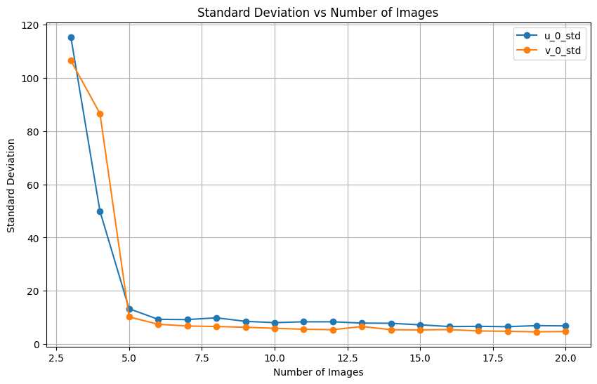
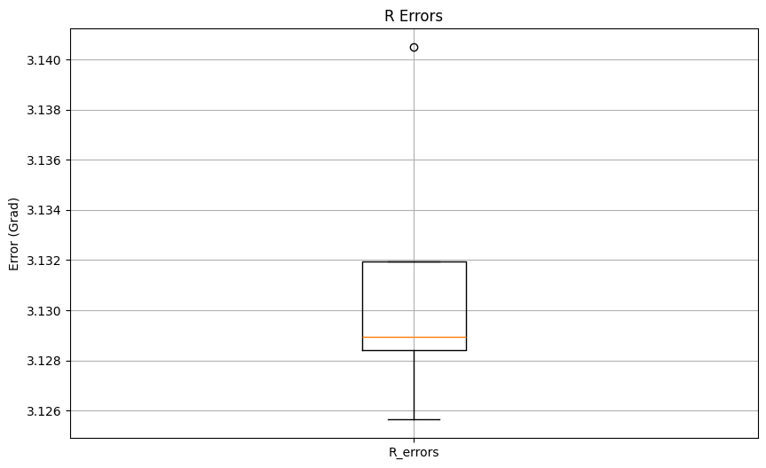
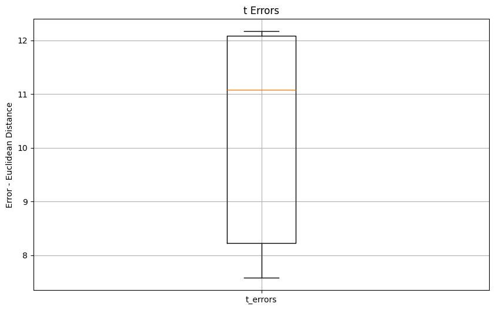

# Computer Vision and Pattern Recognition Project

## Lorenzo Cusin – Giacomo Serafini – Pietro Terribile

## Project 1 — Camera Calibration

### Introduction

The **camera calibration problem** consists in estimating the intrinsic and extrinsic parameters of a camera through several measurements.  
The outcome of these calculations is the **Perspective Projection Matrix** \( P \), which can be written as:

P = K [R | t]

Here:

- **\( K \)** is the intrinsic matrix, containing the internal parameters of the camera (specific to the camera itself), like the .  
- **\( R \)** and **\( t \)** are respectively the rotation matrix and the translation vector, describing the camera pose for a specific image relative to the **World Reference Frame**.
Once that these parameters are found, many computer vision tasks can be performed, such as **Triangulation**, **Structure from motion**, **Camera pose**, **Stereoscopy** and many other things that have become more and more popular and usefull nowadays.

### Task 1 - Zhang's Calibration method 
It is required to calibrate (so to find the unique K and a pair [R | t] for each image) using the Zhang's procedure, which is based on a key principle: instead of requiring a single image of many non-coplanar points (as is necessary for Direct Linear Transform, or DLT, methods), Zhang's approach utilizes multiple images (at least three) of a simple planar calibration pattern.
In our case we are provided with 81 images of a checkerboard, each image is taken from a different point in the World reference frame. 
The foundation of Zhang's method relies on establishing a mathematical relationship, known as a **homography** (H), between the known 3D plane in the scene and its 2D perspective projection onto the image plane.
First of all, we import **numpy** and **OpenCV** libraries to our code: 

```python

  import numpy as np
  import cv2

```

Then we followed the **LabLecture_1** steps to find the keypoints between the given images, here we utilize the function **findChessboardCorners** from OpenCV library, getting the corresponcences we need to estimate the **homography**:

```python

def get_corners(img_path:str, grid_size:tuple) -> np.ndarray:

    img = cv2.imread(img_path)
    return_value, corners = cv2.findChessboardCorners(img, patternSize=grid_size, corners=None) # type: ignore
    if not return_value:
        raise Exception(f"Corners not found in image {img_path}")
    return corners.squeeze(1)

```

This function is then called inside another function we wrote to compute the homography matrix H:

```python

def get_homography(img_path:str, grid_size, square_size) -> tuple[np.ndarray, np.ndarray]:
    
  corners = get_corners(img_path, grid_size)
        
  # CONSTRUCT A
  A = []
  for index, corner in enumerate(corners):
      # getting the coordinates in pixels
      u_coord = corner[0]
      v_coord = corner[1]
        
      # defining the grid structure of the checkerboard
      grid_size_cv2 = tuple(reversed(grid_size))  # we want (rows, cols), not (cols, rows)
      u_index, v_index = np.unravel_index(index, grid_size_cv2)  # the first corner is at position (0,0), the second (0,1)
      
      # finding the (x,y) coordinates wrt the checkerboard
      x_mm = (u_index) * square_size
      y_mm = (v_index) * square_size
        
      eq_1 = [x_mm, y_mm, 1, 0, 0, 0, -u_coord*x_mm, -u_coord*y_mm, -u_coord]
      eq_2 = [0, 0, 0, x_mm, y_mm, 1, -v_coord*x_mm, -v_coord*y_mm, -v_coord]
        
      A.append(eq_1)
      A.append(eq_2)

  # evaluating the SVD of A
  A = np.array(A)
  _, _, V = np.linalg.svd(A, full_matrices=False) # fill_matrices = False -> no padding and faster

  # V is transposed so the values of H are in the last row
  H = V[-1, :].reshape(3,3)
  return A, H

```

Another function, called "get_v_vector", is used to compute the constraints vector of six unknowns starting from the homography:

```python
def get_v_vector(H:np.ndarray, i:int, j:int) -> np.ndarray:

  i -= 1
  j -= 1
    
  return np.array([
      H[0,i] * H[0,j],
      H[0,i] * H[1,j] + H[1,i] * H[0,j],
      H[1,i] * H[1,j],
      H[2,i] * H[0,j] + H[0,i] * H[2,j],
      H[2,i] * H[1,j] + H[1,i] * H[2,j],
      H[2,i] * H[2,j]
  ])

```

After that, we wrote other two functions, respectively "get_intrinsic" and "get_extrinsic", which will compute the both K and the pair [R | t].
The first one computes the Singular Value Decomposition (SVD) of the constraints matrix V (in which are stacked 2n x 6 equations, given n planes), then extracts from it the smallest singular vector which will be the solution to the problem. Later on, it performs Cholesky decomposition, finally finding K matrix.

```python

def get_intrinsic(V:np.ndarray) -> np.ndarray:
    
    _, _, S = np.linalg.svd(V, full_matrices=False) # full_matrices = False -> no padding and faster
    B = S[-1, :]  # S is transposed so the values of B are in the last row
    B /= B[-1]
    
    # __________ CHOLESKY __________
    B = np.array([
        B[0], B[1], B[3],
        B[1], B[2], B[4],
        B[3], B[4], B[5]
    ])
    L = np.linalg.cholesky(B.reshape(3, 3))
    K = np.linalg.inv(L.transpose())
    K = K / K[2,2]
    # K[2, 2] = 1.0
    return K

```

The latter computes column-wise the rotation matrix R and t, starting from the fact that P = [R | t] = K [r1 r2 r3 | t].

```python

def get_extrinsic(K:np.ndarray, H:np.ndarray) -> tuple[np.ndarray, np.ndarray]:
    
    K_inv = np.linalg.inv(K)
    lam = 1 / np.linalg.norm(K_inv @ H[:, 0])
    
    t = lam * K_inv @ H[:, 2]
    if t[2] < 0:
        t = -t
        lam = -lam

    r1 = lam * K_inv @ H[:, 0]
    r2 = lam * K_inv @ H[:, 1]
    r3 = np.linalg.cross(r1, r2)

    R = np.stack([r1,r2,r3]).transpose()
    # R = np.column_stack((r1, r2, r3))

    U, _, Vt = np.linalg.svd(R) # SVD-based orthonormalization to ensure orthonormal columns and det(R) = +1
    R = U @ Vt

    return R, t

```
Here later on the realization of the project, we had to add this portion of code to the function 
```python
    if t[2] < 0:
        t = -t
        lam = -lam
```
This had to be done because there exists two possible solutions to the problem when computing extrinsics, but only one has the right physical meaning: in fact, being the checkerboard in front of the camera, we expect the value of t_z to be positive (since we defined the camera reference frame this way, with Z > 0), but sometimes this was not true, and in the superimposition task we observed that for some images, the value was negative and the cylinder was entering the frame rather that getting out; this corresponded to the WRF to be considered behind the camera, which is clearly unfeasable. So, we are able to detect the wrong solution by checking this value and correct it taking the opposite, which means taking the opposite scale factor **lambda**. 

Now that we have everything required, the following execution code is shown. 
Here we process all the checkerboards we are provided with: 

```python

# constants
grid_size = (8,11)
square_size = 11

# getting the images path
images_path = "../images_and_poses_for_project_assignment/"
images_path = [os.path.join(images_path, imagename) for imagename in os.listdir(images_path) if imagename.endswith(".png")]

```

After that we can recall the functions shown upon for all the images provided. 
First we compute the homographies:

```python

V = []
all_H = []  # saving the homographies for each image

# getting the homographies
for img in images_path:
    _, H = u.get_homography(img, grid_size, square_size)
    all_H.append(H)
    
    v_12 = u.get_v_vector(H, 1, 2)
    v_11 = u.get_v_vector(H, 1, 1)
    v_22 = u.get_v_vector(H, 2, 2)
    
    V.append(v_12)
    V.append(v_11 - v_22)
    
# computing params
V = np.array(V)

```

Then we compute the matrix of intrinsics parameters: 

```python
K = u.get_intrinsic(V)
```

And finally, we compute the pair [R | t] for each image processed: 

```python

all_R = []
all_t = []

for H in all_H:
    R, t = u.get_extrinsic(K, H)
    all_R.append(R)
    all_t.append(t)

```

### Task 2 - Total Reprojection Error 
For this task we are required to choose one of the calibration images and compute the total reprojection
error, which quantifies the projection error, i.e. the distance between the projections (coordinates) of the measured image points and the projections estimated by the geometric model of the camera (perspective projection matrix P). This job is asked to be done for each grid point and to visualize it. 
To realize that, first of all we defined the function **get_projection_matrix** to compute the P matrix for an image given intrinsics and extrinsics parameters: 

```python

def get_projection_matrix(K: np.ndarray, R: np.ndarray, t: np.ndarray) -> np.ndarray:
    
    G = np.zeros((3, 4))
    G[:, :3] = R
    G[:, 3] = t
    return  K @ G

```

After that, to achieve the requirements we need to project 3D points onto a 2D image plane using the provided projection matrix. So we defined the function **project**:

```python

def project(points:np.ndarray, P:np.ndarray) -> np.ndarray:

  if len(points.shape) == 1:
      points = np.expand_dims(points, axis=0)
  
  projected_u = (P[0, :] @ points.transpose()) / (P[2, :] @ points.transpose())
  projected_v = (P[1, :] @ points.transpose()) / (P[2, :] @ points.transpose())
  return np.stack([np.array([u, v]) for u, v in zip(projected_u, projected_v)])

```

Now that we have the necessary tools, the following code is executed: 

```python

# getting the image and extrinsics
img_path = images_path[1]
R1 = all_R[1]
t1 = all_t[1]

# combining R and t
P = u.get_projection_matrix(K, R1, t1)

corners = u.get_corners(img_path, grid_size)
projected_corners = []

error = 0
for index, corner in enumerate(corners):
    u_coord = corner[0]
    v_coord = corner[1]

    grid_size_cv2 = tuple(reversed(grid_size))
    u_index, v_index = np.unravel_index(index, grid_size_cv2)

    # the coordinates of the corner w.r.t. the reference corner at position (0,0) of the corners array
    x_mm = (u_index) * square_size
    y_mm = (v_index) * square_size

    point_m = np.array([x_mm, y_mm, 0, 1])

    projected_u, projected_v = u.project(point_m, P)[0]
    projected_corners.append((projected_u, projected_v))
    
    error += (projected_u - u_coord)**2 + (projected_v - v_coord)**2
print(f"Error: {error:.2f}")
print(f"Mean error per corner: {error/len(corners):.2f}")

```
The results we got for image 0 were the following: 
  -  Error: 23.09
  -  Mean error per corner: 0.26

<div style="
  width: 100%;
  text-align: center;
  margin: 2em 0 3em 0;
">
  
  <div style="margin-top: 0.8em; font-style: italic;">
    Figure 1: Projected corners after calibration.
  </div>
</div>


The second data is the most interesting: a value of 0.26 means that, on average, the points that the geometric model predicts are located on the image are about a quarter of a pixel away from their actual position in the image. This is considered a good result overall, meaning that the camera model is geometrically accurate.

To show the projected corners, the code below is executed: 

```python

image = cv2.imread(img_path)
image_rgb = cv2.cvtColor(image, cv2.COLOR_BGR2RGB)  # type: ignore

for corner in projected_corners:
    u_coord, v_coord = int(corner[0]), int(corner[1])
    cv2.circle(image_rgb, (u_coord, v_coord), radius=5, color=(255, 0, 0), thickness=-1)

px.imshow(image_rgb)

```

### Task 3 - Superimposing a cylinder 
The next task requires to superimpose an object, in this case a cylinder, on 25 checkerboards and visualize the correctness of the previous computations and results. 
To complete the task, we defined a function called **superimpose_cylinder**, that in the first place generates the 3D points of a cylinder of a given radius and height by approximating it through sides and slices. Then, given matrix P of an image, projects the 3D cylinder on the 2D image. 

```python
   
def superimpose_cylinder(
    img_path: str, 
    P: np.ndarray,
    radius: float, 
    height: float, 
    center_x: float, 
    center_y: float, 
    num_sides: int = 30, 
    num_height_slices: int = 5
) -> np.ndarray:
    
    # Generation of 3D Points 
    theta = np.linspace(0, 2 * np.pi, num_sides, endpoint=False)
    z_slices = np.linspace(0, height, num_height_slices) 
    points_3d = []

    # Perimetral points for each height slice
    for z in z_slices:
        x = center_x + radius * np.cos(theta)
        y = center_y + radius * np.sin(theta)
        Z = np.full_like(x, z)
        # Coordinate omogenee [x, y, z, 1]
        homogeneous_slice = np.vstack((x, y, Z, np.ones_like(x))).T
        points_3d.append(homogeneous_slice)

    # Bottom slice (Z = 0)
    x_base = center_x + radius * np.cos(theta)
    y_base = center_y + radius * np.sin(theta)
    base_points = np.stack([x_base, y_base, np.zeros_like(x_base), np.ones_like(x_base)], axis=1)
    points_3d.append(base_points)

    # Top slice (Z = height)
    x_top = center_x + radius * np.cos(theta)
    y_top = center_y + radius * np.sin(theta)
    top_points = np.stack([x_top, y_top, np.full_like(x_top, height), np.ones_like(x_top)], axis=1)    # TODO: Z axis is inverted
    points_3d.append(top_points)
    
    object_points = np.concatenate(points_3d, axis=0) # shape (N, 4)
    
    # Pojection of 3D Points onto the Image Plane
    img = cv2.imread(img_path)
    if img is None:
        raise FileExistsError(f"Cannot find the image file at {img_path}.")

    points_2D_hom = project(object_points, P)
    u = points_2D_hom[:, 0]
    v = points_2D_hom[:, 1]
    
    projected_points = np.stack([u, v], axis=1).astype(np.int32) 

    # Base
    base_start_idx = projected_points.shape[0] - 2 * num_sides
    base_points_proj = projected_points[base_start_idx : base_start_idx + num_sides]
    
    # Top
    top_points_proj = projected_points[base_start_idx + num_sides : ]

    # Drawing base
    cv2.polylines(img, [base_points_proj], isClosed=True, color=(0, 0, 255), thickness=2) 
    
    # Drawing top
    cv2.polylines(img, [top_points_proj], isClosed=True, color=(0, 255, 0), thickness=2) 
    center_projection = project(np.array([center_x, center_y, 0, 1]), P)[0]
    cv2.circle(img, (int(center_projection[0].round()), int(center_projection[1].round())), radius=5, color=(255, 0, 0), thickness=-1)
    # Drawing vertical sides
    side_idxs = np.linspace(0, num_sides - 1, num_sides, dtype=int)
    for side in side_idxs:
        pt_base = base_points_proj[side]
        pt_top = top_points_proj[side]
        cv2.line(img, tuple(pt_base), tuple(pt_top), color=(255, 0, 0), thickness=1)
        
    return img

```

The execution code of the task is right below, in which we recalled the **get_projection_matrix** for each of the 25 images before superimposing the cylinders: 

```python

import random

random.seed(0)
NUM_IMAGES_TO_PROCESS = 25

images_indices = random.sample(range(len(images_path)), NUM_IMAGES_TO_PROCESS)

# 3D parameters of the cylinder (remain fixed for all projections)
radius_mm = 22.0
height_mm = 80.0

# Positioning consistent with the origin of the checkerboard (e.g. 4 squares, 4 squares)
center_x_mm = 5 * square_size 
center_y_mm = 4 * square_size
num_sides_cyl = 30 # Cylinder resolution
num_height_slices_cyl = 5

superimposed_image_list = []

for i in images_indices:
    img_path = images_path[i]
    R_i = all_R[i]
    t_i = all_t[i]
    P = u.get_projection_matrix(K, R_i, t_i)
    
    superimposed_image = u.superimpose_cylinder(
        img_path=img_path, 
        P=P,
        radius=radius_mm, 
        height=height_mm, 
        center_x=center_x_mm, 
        center_y=center_y_mm,
        num_sides=num_sides_cyl,
        num_height_slices=num_height_slices_cyl
    )
    
    superimposed_image_list.append(superimposed_image)
    
px.imshow(superimposed_image_list[0])

```

<div style="
  width: 50%;
  text-align: center;
  margin: 2em 0 3em 0;
">
  
  <div style="margin-top: 0.8em; font-style: italic;">
    Figure 2: Example of superimposed cylinder.
  </div>
</div>

### Task 4 - Standard deviation of principal point 
In this exercize it is requested to plot the standard deviation of the entries u_0 and v_0 of calibration matrix K as a function of the images processed to compute the intrinsics parameters. The minimum number of planes required to compute K is 3; and for some combination of images the matrix K could be not positive definite, so not feasable for computations (Cholesky). In the following code, for each number of images, multiple random subsets are sampled and used to compute the intrinsic matrix. The standard deviation of the principal point coordinates (u_0 and v_0) across samples is then computed and plotted, showing how the estimation variance decreases as more images are used. As we can see, as soon as the image group consists of only 6-7 elements, the standard deviation is minimal.

```python

random.seed(0)
max_N_images = 20
N_images = list(range(3, max_N_images + 1))
n_samples = 100

# since V is a stack of two equations per image,
# I can use them to compute K instead of recomputing V each time
index_to_select = list(range(0, len(V), 2))

u0_std = []
v0_std = []

for n_images in range(3, max_N_images + 1):
    current_sample = 1
    principal_point_coord = []
    while current_sample <= n_samples:
        selected_images = np.array(random.sample(index_to_select, n_images))
        _V = np.concatenate([V[selected_images], V[selected_images + 1]])

        # some matrices could be not positive definite -> no solution
        try:
            K = u.get_intrinsic(np.array(_V))
        except:
            continue
        
        principal_point_coord.append([K[0,2], K[1,2]])
        current_sample += 1
    
    principal_point_coord = np.stack(principal_point_coord)
    _u0_std, _v0_std = principal_point_coord.std(axis=0)
    u0_std.append(_u0_std.item())
    v0_std.append(_v0_std.item())
    
plt.figure(figsize=(10, 6))
plt.plot(N_images, u0_std, marker='o', label='u_0_std')
plt.plot(N_images, v0_std, marker='o', label='v_0_std')
plt.xlabel('Number of Images')
plt.ylabel('Standard Deviation')
plt.title('Standard Deviation vs Number of Images')
plt.grid(True)
plt.legend()
plt.show()

```

<div style="
  width: 50%;
  text-align: center;
  margin: 2em 0 3em 0;
">
  
  <div style="margin-top: 0.8em; font-style: italic;">
    Figure 3: Standard deviation vs number of images.
  </div>
</div>

### Task 5 - Comparing the estimated R,t pairs

In this task it is requested to compare the extrinsics parameter previously got with the ones given by Professor, by computing the rotation matrix from frame <b>A</b> to frame <b>B</b> and the norm of the  corresponding angle of rotation. 
Notice that, since **.yaml** files are scaled in **meters**, while ours in **millimeters**, we needed to multiply by a factor of 1000 the t vector:

```python

R_errors = []
t_errors = []

for i, pose in enumerate(poses_path[:5]):
    with open(pose, 'r') as file:
        data = yaml.safe_load(file)
        R = all_R[i]
        t = all_t[i]
        R_CS = np.array(data["R_CS"]).reshape(3,3)
        t_CS = np.array(data["T_CS"]) * 1000    # in our code we consider millimiters, in yaml file meters
        
        R_AB = R_CS @ R.T
        R_errors.append(np.absolute(np.arccos((np.trace(R_AB) - 1) / 2)))
        t_errors.append(np.linalg.norm(t - t_CS))
        
# Boxplot for R_errors
plt.figure(figsize=(10, 6))
plt.boxplot(R_errors, tick_labels=['R_errors'])
plt.ylabel('Error - Angle in radians')
plt.title('R Errors')
plt.grid(True)
plt.show()

# Boxplot for t_errors
plt.figure(figsize=(10, 6))
plt.boxplot(t_errors, tick_labels=['t_errors'])
plt.ylabel('Error - Euclidean Distance')
plt.title('t Errors')
plt.grid(True)
plt.show()

```

<div style="display: flex; justify-content: center; align-items: flex-start; gap: 20px; background-color: #0d1117; padding: 2em; border-radius: 8px;">

  <div style="flex: 1; max-width: 400px; text-align: left;">
    
    <div style="color: white; margin-top: 10px; font-family: sans-serif; font-size: 0.95em;">
      Figure 4: R errors boxplot.
    </div>
  </div>

  <div style="flex: 1; max-width: 400px; text-align: left;">
    
    <div style="color: white; margin-top: 10px; font-family: sans-serif; font-size: 0.95em;">
      Figure 5: t errors boxplot.
    </div>
  </div>

</div>

</div>

Analyzing the boxplots, we can conclude some observations:
  -  Rotation (R Errors): The boxplot shows a very high, yet extremely stable, error centered around 3.13 radians. This value is approximately equal to $\pi$, indicating a systematic 180° rotation. This suggests a difference in coordinate system conventions (e.g., the direction of the Z-axis) between the two models rather than a failure in the calibration itself.
  -  Translation (t Errors): The translation error fluctuates between 7.5 mm and 12.2 mm, with a median near 11 mm. This indicates a metric discrepancy likely caused by slight variations in the estimation of the camera's distance from the board.
  -  Stability: Both plots exhibit relatively small "whiskers," which implies that the calibration algorithm is robust and consistent across different images, despite the fixed orientation bias.

### Task 6 - Our own calibration 
Point 6 requires to print a checkboard, take several images of it and estimate the parameters of our own camera.
We took 30 HD images of a (11,18) checkerboard with a Google Pixel smartphone and followed the exact same path of the previous tasks. Of course we can't conclude much investigating extrinsics parameters, but we can observe that the calibration matrix K in almost every entry has higher values than the given one. 
Moreover, by estimating the **Total Reprojection Error**, over image 0 we get a **mean error per corner** of 0.81, which is consistent with the model previously tested. 
To assess such thing we decided to rescale the pictures taken from us (1600x1200) into the shape of those given by professor (1280x720). Doing so, we could compare the results and confirm that the model works well, because the **total mean error per corner** for our pictures is **1.21**, while for Professor's images is **1.12**. 

The code used, which does the scaling before the same actions performed by task 2 over all images, is the following: 

```python

old_w, old_h = 1600, 1200
new_w, new_h = 1280, 720
sx = new_w / old_w
sy = new_h / old_h

K_scaled = K.copy()
K_scaled[0, 0] *= sx  # fx
K_scaled[1, 1] *= sy  # fy
K_scaled[0, 2] *= sx  # u0
K_scaled[1, 2] *= sy  # v0

viz_img_index = 0 
projected_corners_viz = []
image_to_show = None
total_sum_error = 0.0

for i in range(len(all_H)):
    img_path = images_path[i]
    P = u.get_projection_matrix(K_scaled, all_R[i], all_t[i])

    try:
        corners_orig = u.get_corners(img_path, grid_size)
    except Exception:
        continue

    grid_size_cv2 = tuple(reversed(grid_size))
    
    for index, corner in enumerate(corners_orig):

        u_coord = corner[0] * sx 
        v_coord = corner[1] * sy
        
        u_index, v_index = np.unravel_index(index, grid_size_cv2)
        point_m = np.array([u_index * square_size, v_index * square_size, 0, 1])

        projected_u, projected_v = u.project(point_m, P)[0]
        
        error += (projected_u - u_coord)**2 + (projected_v - v_coord)**2
        total_corners_count += 1

        if i == viz_img_index:
            projected_corners_viz.append((projected_u, projected_v))


if total_corners_count > 0:
    print(f"Total error (all images): {error:.2f}")
    print(f"Mean error per corner (total): {error/total_corners_count:.4f}")


raw_img = cv2.imread(images_path[viz_img_index])

# Important: the image must be resized to match K_scaled and the points.

img_resized = cv2.resize(raw_img, (new_w, new_h))
image_rgb = cv2.cvtColor(img_resized, cv2.COLOR_BGR2RGB)

for cp in projected_corners_viz:
    cv2.circle(image_rgb, (int(cp[0]), int(cp[1])), radius=3, color=(255, 0, 0), thickness=-1)

px.imshow(image_rgb)

```

<div style="
  width: 50%;
  text-align: center;
  margin: 2em 0 3em 0;
">
  
  <div style="margin-top: 0.8em; font-style: italic;">
    Figure 6: Projected corners after rescaling and calibration.
  </div>
</div>


Then it comes to superimposing the cylinder to our own chessboard: 


<div style="
  width: 50%;
  text-align: center;
  margin: 2em 0 3em 0;
">
  
  <div style="margin-top: 0.8em; font-style: italic;">
    Figure 7: Superimposed cylinder on our chessboard.
  </div>
</div>

Later on, the standard deviation of the entries u_0 and v_0 of calibration matrix K as a function of the images processed:

<div style="
  width: 50%;
  text-align: center;
  margin: 2em 0 3em 0;
">
  
  <div style="margin-top: 0.8em; font-style: italic;">
    Figure 8: Standard Deviation of u_0 and v_0 vs number of images processed.
  </div>
</div>

Notice that task 5 is not reported since comparing the estimates taken by Professor with ours is meaningless.

### Task 7 - Minimize reprojection error 
In this exercize it is asked to minimize the reprojection error instead of the algebrain one using **Maximum Likelihood** Estimation approach, suggested in Section 3.2 of Zhang, 2002. 
The following code refines both intrinsic and extrinsic camera parameters by minimizing the reprojection error of checkerboard corners.  
The 3D coordinates of the checkerboard corners are first defined in the WRF, while the corresponding 2D image points are extracted from all calibration images.  
A non-linear least-squares optimization based on the Levenberg–Marquardt algorithm is then applied to jointly optimize the camera intrinsics, rotations (parameterized using axis–angle representation), and translations. 
First thing first, we had to define some function to implement the Rodrigues formula (https://en.wikipedia.org/wiki/Axis%E2%80%93angle_representation), cited in Zhang's paper: 
The first one computes the rotation axis and angle from a given rotation matrix R, calculating the corresponding rotation axis (a unit vector) and the rotation angle (in radians).
```python
def get_rot_axis_from_R(R: np.ndarray) -> tuple[np.ndarray, float]:

  theta = float(np.arccos((np.trace(R) - 1) / 2))
  _r = np.array([
        R[2,1] - R[1,2],
        R[0,2] - R[2,0],
        R[1,0] - R[0,1],
    ])
  return (1/(2*np.sin(theta))) * _r * theta, theta

```
The second one computes the rotation matrix from an axis-angle representation by taking a 3D vector representing the axis of rotation scaled by the rotation angle (in radians) and computes the corresponding  rotation matrix.
```python

def get_R_from_axis(r: np.ndarray) -> np.ndarray:
   
    theta = np.linalg.norm(r)
    r = r / theta
    # cross product matrix
    r_x = np.stack([
        [ 0  , -r[2], r[1]  ],
        [r[2] ,   0  , -r[0]],
        [-r[1], r[0],   0   ],
    ])
    
    return np.eye(3) + \
            np.sin(theta) * r_x + \
            (1 - np.cos(theta)) * np.linalg.matrix_power(r_x, 2)
```

Then we had to define the function **compute_residuals** to compute the residuals between the projected checkerboard corners and the observed image corners.

```python

def compute_resiudals(params: np.ndarray, checkerboard_world_corners: np.ndarray, checkerboard_image_corners: np.ndarray):
    
    n_images = (len(params) - 5) // 3 // 2
    alpha_u, skew, u_0, alpha_v, v_0 = params[:5]
    K = np.stack([
        [alpha_u, skew, u_0],
        [0, alpha_v, v_0],
        [0, 0, 1],
    ])
        
    r = np.array(params[5:(5 + (n_images * 3))]).reshape(-1, 3)
    t = np.array(params[-(n_images * 3):]).reshape(-1, 3)

    R = np.stack([get_R_from_axis(r[i]) for i in range(n_images)])
    P = np.stack([get_projection_matrix(K, R[i], t[i]) for i in range(n_images)])
    
    projected_points = P @ checkerboard_world_corners.T
    projected_points = np.stack([projected_points[:, 0] / projected_points[:, 2], projected_points[:, 1] / projected_points[:, 2]], axis=2)
    
    residuals = projected_points - checkerboard_image_corners
    return residuals.ravel()

```

Then

```python

# least square computed using Levenberg-Marquardt
least_square_output = least_squares(
    u.compute_resiudals,
    all_params,
    args=(checkerboard_world_corners, checkerboard_image_corners),
    method="lm"
)

# reconstructing the solutions
n_images = (len(all_params) - 5) // 3 // 2
alpha_u, skew, u_0, alpha_v, v_0 = least_square_output.x[:5]

refined_K = np.stack([
    [alpha_u, skew, u_0],
    [0, alpha_v, v_0],
    [0, 0, 1]
])

r = np.array(least_square_output.x[5:(5 + (n_images * 3))]).reshape(-1, 3)
refined_t = np.array(least_square_output.x[-(n_images * 3):]).reshape(-1, 3)

refined_R = np.stack([u.get_R_from_axis(r[i]) for i in range(n_images)])

```
Finally, the refined parameters are used to project the 3D points back onto the image plane, and the reprojection error is computed and visually validated by overlaying the projected corners onto the original image.

The results show that the procedure worked well, since both the error and the mean error per corner got lower, respectively 10.32 and 0.12, against the previously gotten 23.09 and 0.26, always referring to the picture below (image[0]). 

<div style="
  width: 50%;
  text-align: center;
  margin: 2em 0 3em 0;
">
  
  <div style="margin-top: 0.8em; font-style: italic;">
    Figure 9: Projected corners after reprojection error minimization
  </div>
</div>

### Task 8 - Adding radial distorsion compensation 
In this part, we need to add radial distorsion compensation to the basic Zhang's calibration procedure. So we based our implementation on the following formulas: 

$$
\begin{cases} 
\hat{u} = (u - u_0)(1 + k_1r_d^2 + k_2r_d^4) + u_0 \\ 
\hat{v} = (v - v_0)(1 + k_1r_d^2 + k_2r_d^4) + v_0 
\end{cases}
 \
$$

$$
r_d^2 = \left(\frac{u - u_0}{\alpha_u}\right)^2 + \left(\frac{v - v_0}{\alpha_v}\right)^2 \
$$

$$
K = \begin{bmatrix} 
\alpha_u & \alpha_u \cot\omega & u_0 \\ 
0 & \alpha_v / \sin\omega & v_0 \\ 
0 & 0 & 1 
\end{bmatrix}
$$
