# Computer Vision and Pattern Recognition Project

Authors: Lorenzo Cusin – Giacomo Serafini – Pietro Terribile

# Project 1 — Camera Calibration

## Introduction

The **camera calibration problem** consists in estimating the intrinsic and extrinsic parameters of a camera through several measurements.  
The outcome of these calculations is the **Perspective Projection Matrix** $P$, which can be written as:

$$P = K [ R | t ]$$

where:

- $K$ is the intrinsic matrix, containing the internal parameters of the camera (specific to the camera itself);
- $R$ and $t$ are respectively the rotation matrix and the translation vector, describing the camera pose.

## Task 1 - Zhang's Calibration Method

It is required to calibrate the camera (thus finding the unique K and the pair $[R | t]$ for each image) by using the Zhang's procedure, which is based on a key principle: instead of starting from a single image and collecting from that $n$ non co-planar points to get the correspondences as required by DLT, start from taking at least three pictures of a plane from different positions in the space, such that it is possible to establish a mathematical relationship, known as homography (a matrix $H$), between the known 3D plane in the scene (the checkerboard) and its 2D perspective projection onto the image plane.

In our case we are provided with 81 images of a checkerboard, our calibration pattern, where each image is taken from a different point in the World reference frame. The checkerboard is composed of a grid of $(8,11)$ reference corners whose coordinates will be used to estimate the parameters.

In fact their World and Image coordinates are sufficient to estimate $H$: the first ones are easily derived by fixing the World reference orgin into a point in the checkerboard, in our case the bottom-left corner, and knowing the length of the squares' sides; the latter ones, instead, are simply their location in pixels, which can be easily computed using the `findChessboardCorners` OpenCV function (we also used `cornerSubPix` to improve the accuracy of the location). After collecting the data, a system of equation is built following the DLT method and considering the 3D plane to have equation $Z=0$:

$$
A_ih = 0
$$

where:
- $A_i$ are the coefficients of the equations derived by the corner $i$ of the image and whose entries are: $$ \begin{bmatrix} x & y & 1 & 0 & 0 & 0 & -ux & -uy & -u \\ 0 & 0 & 0 & x & y & 1 & -vx & -vy & -v \end{bmatrix} $$ with $(x,y,1)$ as world homogeneous coordinates and $(u,v,1)$ as image homogeneous coordinates;
- $h$ is a vector of size 9 that contains the entries of the matrix $H$.

All the $A_i$  are stacked together and the overdetermined system solution is solved by means of Singular Value Decomposition (practically, the solution is the last column of the obtained matrix V). The resulting matrix $H$ is a 3x3 matrix (since the plane has equation $Z=0$, the third component is cut off and basically $H$ 's entries are the first, second and fourth columns of $P$).

After the estimation of the homography for each image, to estimate the camera parameters another system of equation must be solved. Due to the strict relation between homography and perspective projection, Zhang proceeded to relate the homography with the rigid matrix that is part of $P$. Observing that:

$$
H = \lambda [p_1 \ p_2 \ p_4]
$$

And that

$$
P = K [R|t]
$$
Therefore $H$ is related to $R$, in fact: 

$$
H = \lambda K [r_1 \ r_2 \ t]
$$

$$\begin{cases} 
h_1 = \lambda K r_1 \\ 
h_2 = \lambda K r_2 
\end{cases} \implies 
\begin{cases} 
r_1 = \frac{1}{\lambda} K^{-1} h_1 \\ 
r_2 = \frac{1}{\lambda} K^{-1} h_2 
\end{cases}$$
Then, Zhang imposed the rotational constraints to this formulation of $H$. Thus:$$\begin{cases} 
r_1^\top r_2 = 0 \\ 
r_1^\top r_1 = r_2^\top r_2 
\end{cases} \xrightarrow{} 
\begin{cases} 
h_1^\top (K K^\top)^{-1} h_2 = 0 \\ 
h_1^\top (K K^\top)^{-1} h_1 = h_2^\top (K K^\top)^{-1} h_2 
\end{cases}$$And $B = (K K^\top)^{-1}$ is imposed. Notice that $B$ is symmetric, so it has 6 unknown entries. These are stacked in a vector $b = [B_{11}, B_{12}, B_{22}, B_{13}, B_{23}, B_{33}]^\top$. Now, taking all the 81 planes and the respective homographies, we get 162 constraints on the same $B$. To solve the previous system of equations in $B$, we relied on the support vector $v$, since it is easy to check that, for $i,j \in \{1,2\} $, $h_i^\top B h_j$ can be written as the dot product $v_{ij}^\top b$, where$$v_{ij} = \begin{bmatrix}
H_{1i}H_{1j} \\
H_{1i}H_{2j} + H_{2i}H_{1j} \\
H_{2i}H_{2j} \\
H_{3i}H_{1j} + H_{1i}H_{3j} \\
H_{3i}H_{2j} + H_{2i}H_{3j} \\
H_{3i}H_{3j}
\end{bmatrix}$$

Thus, the constraints for a single image become: 

$$
\begin{bmatrix} 
v_{12}^\top \\ 
(v_{11} - v_{22})^\top 
\end{bmatrix} b = 0
$$

and stacking these for all the planes, the linear system $Vb$ = 0 is obtained. 
Theoretically speaking, for $b$ to be unique, $V$ should be rank 5 and the solution to the problem would be the null space of V, but due to measurement noise the actual rank of $V$ is 6. 
To solve the problem, linear least squares is performed, whose solution is known to be the right singular vector corresponding to the smallest singular value of $V$. 

Once $B$ is uniquely determined, Cholesky factorization is performed on that to compute intrinsics matrix $K$. After that we can reconstruct the extrinsics matrix as well, whose parameters are given by:

$$
r_1 = \lambda K^{-1}h_1, \quad r_2 = \lambda K^{-1}h_2, \quad t = \lambda K^{-1}h_3, \quad r_3 = r_1 \times r_2
$$

Where $$\lambda = 1 / \| K^{-1}h_1 \| = 1 / \| K^{-1}h_2 \| $$ and $\times$ represents the cross product.

Because of noise, the recovered matrix $R = [r_1, r_2, r_3]$ may not orthogonal. To find the closest orthogonal matrix $R'$ in the Frobenius norm, Singular Value Decomposition is performed on the estimated $R$: if $R = U \Sigma V^\top$, then the refined rotation matrix would be $R' = UV^\top$.

### Editor's note

When we faced the third task of the project, we observed that for some immages the cylinder was facing downward instead of upward. Since this happened for a few planes, we tought that this event was happening due to measurement noise when recovering the extrinsic parameters from the images. Therefore, the following check is implemented, which consequently changes both the translation vector and the rotation matrix:
```python
  if t[2] < 0:
     t = -t
     lam = -lam
```
After this was implemented, the superimposition worked as expected.

## Task 2 - Total Reprojection Error

For this task we are required to choose one of the calibration images and compute the total reprojection
error, that is, the distance between the projections (coordinates) of the measured image points and the projections estimated by the geometric model of the camera (perspective projection matrix $P$).

First of all, we selected an image from which to retrieve its extrinsics parameters and with that we built the matrix $P$. With that, we projected the 3D world points of the checkerboard onto the 2D image plane and then we computed the total reprojection error between them and the ($u,v$) coordinates that `findChessboardCorners` previously found.
The computations performed follow this formula:

$$
\epsilon(P) = \sum_{i=1}^{n} \left( \frac{p_1^\top m_{(i)}}{p_3^\top m_{(i)}} - u_{(i)} \right)^2 + \left( \frac{p_2^\top m_{(i)}}{p_3^\top m_{(i)}} - v_{(i)} \right)^2
$$

We decided to print the total error and the mean error per corner, and we used the results we got from `rgb_1.png` as an example:
  -  Error: 23.44
  -  Mean Error Per Corner: 0.01


[TODO: data updated, so check the comment]
The second data is the most interesting: a value of 0.01 means that, on average, the points that the geometric model predicts are located on the image less than an half of a pixel away from their actual position.

### Editor's note

In the notebook, it is possible to see the so-called "normalized" error, which takes into consideration the image resolution. It will be discussed in more detail in *Task 6*, where it will be of greater interest.

## Task 3 - Superimposing a Cylinder

The next task requires to superimpose an object, in this case a cylinder, on 25 checkerboards and to visualize the correctness of the previous computations and results. 
To complete the task, we defined a function that creates a 3D cylinder and renders it onto a specific image. First, it generates a set of 3D points in homogeneous coordinates based on a provided radius, height, and center position ($x, y$) on the world plane. To be more precise, the cylinder's bases circles are approximated by $n$ straight lines, parameter that can be tuned by the user. The same thing is applied to the sides of the cylinder, meaning that users can define the number of vertical slices that plot the side surface. Then, using the camera projection matrix $P$, these 3D points are mapped onto the 2D image plane. Finally, the function uses OpenCV's `polylines` to draw the cylinder's structure.

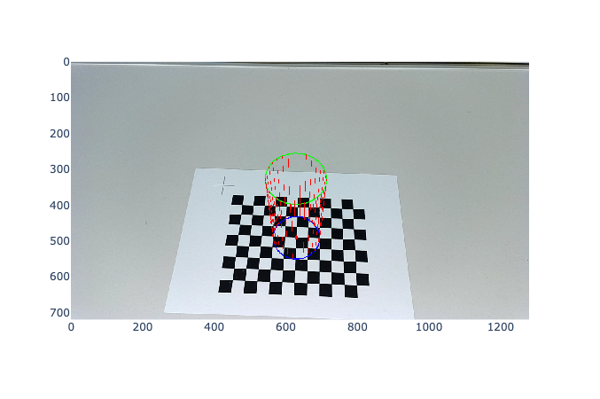

Observing the results, we noticed that when the slope of the plane is evident to the human eye, the cylinder is correctly inclined with the plane. Whereas, when the surface is slightly sloped, so much so that it is imperceptible to the naked eye, it is not to the model and the superimposed cylinder is yet inclined. Here we report three cases of interest of our observations.

In most of the images, we noticed that the cylinders are correctly superimposed. In some cases, though, especially when the camera seems to be parallel to the checkerboard, the superimposition appears slightly wrong: we suppose that this problem is due to the fact that, during the estimation phase of the extrinsic parameters, the model is wrongly estimating the pose of the camera, ever so slightly that the superimposition appears wrong to the naked eye. Again, this is just a supposition, as we cannot fully explain how it behaves so well in most of the images but slightly poor in others, and we even questioned if our eyes were the ones being wrong while the model correctly assumed the angle of the checkerboard.

This is just an example of how good it can actually superimpose the cylinder:

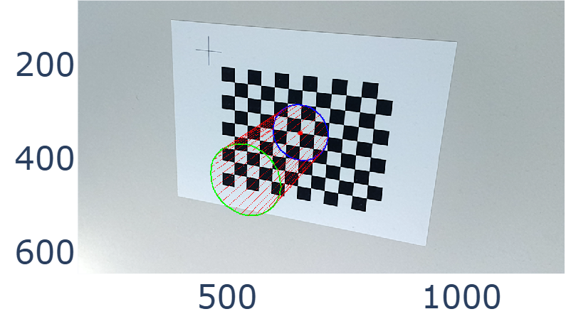

Whereas here we can see how the angle of the superimposed cylinder appears to be wrong (at least to us):

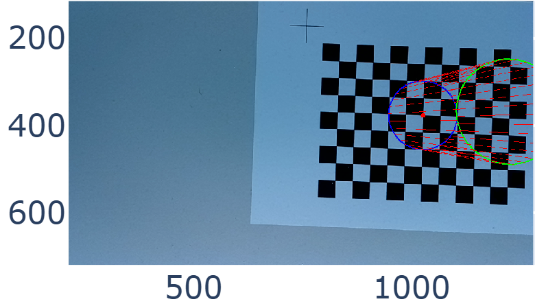

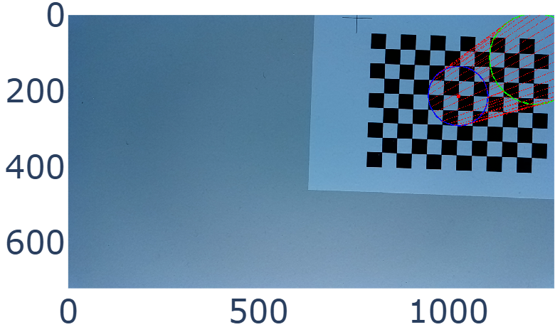

ADD FULL 25 IMAGES

## Task 4 - Standard Deviation of the Principal Point

The exercise asks to analyze how much the uncertainty of the principal point changes while the number of images used to estimate the camera intrinsic is increased. The principal point is the point $(u_0, v_0)$ on the image where the camera’s optical axis intersects the image plane. It is one of the intrinsic parameters and for this reason it is contained in the matrix $K$:

$$
K = \begin{bmatrix} 
\alpha_u & \alpha_u \cot\omega & u_0 \\ 
0 & \alpha_v / \sin\omega & v_0 \\ 
0 & 0 & 1 
\end{bmatrix}
$$

To perform the estimation, a statistical approach is used: several batches of images of size $n\_images \in \{a, \dots, b\}$ are randomly sampled and the standard deviation of $(u_0, v_0)$ is computed for each batch size. We think that this approach is more fair with respect to the combinatorial one, in which all the possible combinations of batches of dimension $n\_images$ are considered to compute the standard deviation. In fact, fixing the number of samples to $n\_samples$ permits to the first approach to create the same number of batches for each size, making the comparison more trustable. This key point is not present in the combinatorial one, as there are more combination of $n$ images than $n+1$. Moreover, the computation is more lightweight, making the code faster to execute. 

In what follows, we can see the results obtained by executing the explained approach using $n\_samples = 100$. Since the minimum number of images required to compute the camera intrinsic with the Zhang's method is $3$ and $20$ images are enough to show the standard deviation trend, $n\_images \in \{3, \dots, 20\}$ is selected:

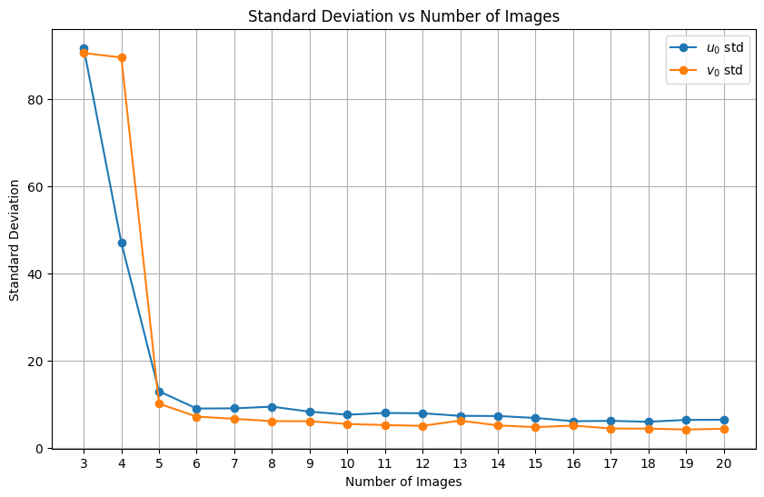

The uncertainty decreases as the number of images increases: this is an expected behaviour. Using more than $7$ images does not appear to significantly improve the accuracy.

## Task 5 - Comparing the Estimated $R,t$ Pairs

In this task it is required to compare the obtained extrinsic parameters $R$ and $t$ with the provided ground truth. The following methods are used to compute the errors:
- **Rotation Error**: given two rotation matrices $R_A$ and $R_B$, the error is defined as:
  $$|\theta| = \left|arccos\left(\frac{tr(R_A R_B) - 1}{2}\right)\right|$$
- **Translation Error**: the error is the Euclidean norm of the difference between the two vectors

The ground truth is provided for only five images and its $t$ vectors are estimated in meters rather than millimeters. To account for the scale mismatch, the ground truth is multiplied by $1000$.

Here are the obtained results:

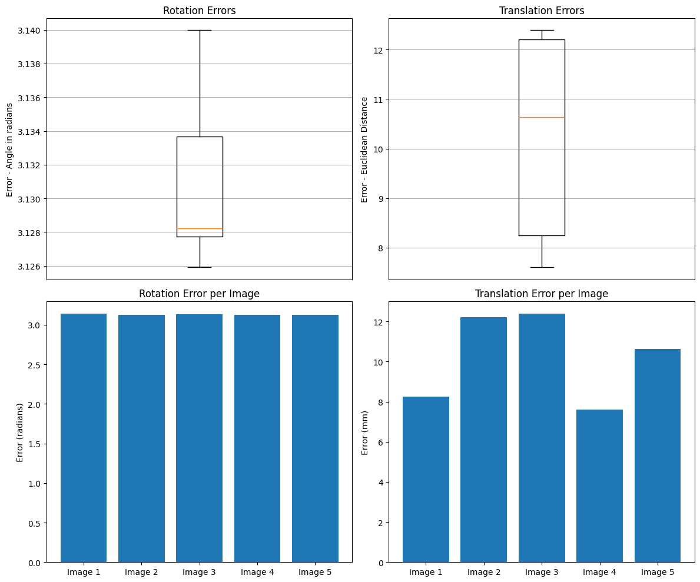

In both cases, the error seems constant for each image. The Translation Error is around $10$ millimeters and it is probably due to the noise present in the estimation process. The Rotation Error, instead, needs a careful analysis. In fact, it is around $\pi = 3.14$ which represent a rotation of $180°$. This phenomenon usually happens when the reference system (world or image) of the two models are defined differently, for instance with the axes $x$ and $y$ inverted. Because of that, a further investigation is needed.

First of all, let's see how a cylinder is projected using the ground truth parameters. If the problem is due to the definition of the reference system, this test should be enough to make it visible. Here, an example with the image `rgb_0.png` is shown: the respective $R$ and $t$ from the ground truth parameters are used, while the $K$ estimated in Task 1 is selected. A cylinder centered at $(0,0)$ is then projected.

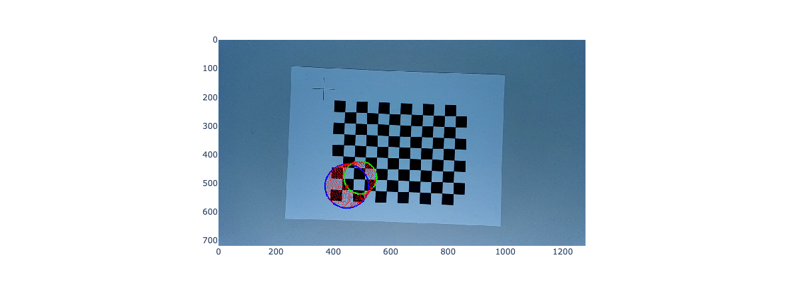

It is evident that:
1. the center $(0,0)$ is not precisely located. This may be caused by the two different estimation processes used to derive $K$, $R$ and $t$. This behaviour is assumed to be normal;
2. the cylinder is projected reversed with respect to our way of projecting, that is, it is growing away from the camera. This seems to confirm our hypothesis.

Let's try to demonstrate the last point estimating our $R$s and $t$s using $x$ and $y$ inverted. To do that, the function `get_homography` is edited as follow:

```python
# Old function
def get_homography(img_path:str, grid_size:tuple, square_size:int) -> np.ndarray:
    ...
    # finding the (x,y) coordinates wrt the checkerboard
    x_mm = u_index * square_size
    y_mm = v_index * square_size
    ...

################### ↓ ###################

# New function
def get_homography(img_path:str, grid_size:tuple, square_size:int) -> np.ndarray:
    ...
    # finding the (x,y) coordinates wrt the checkerboard
    ## inverting x and y
    x_mm = v_index * square_size
    y_mm = u_index * square_size
    ...
```

Basically, the coordinates of the checkerboard's corners are defined with $x$ and $y$ inverted. This change led to the following result:

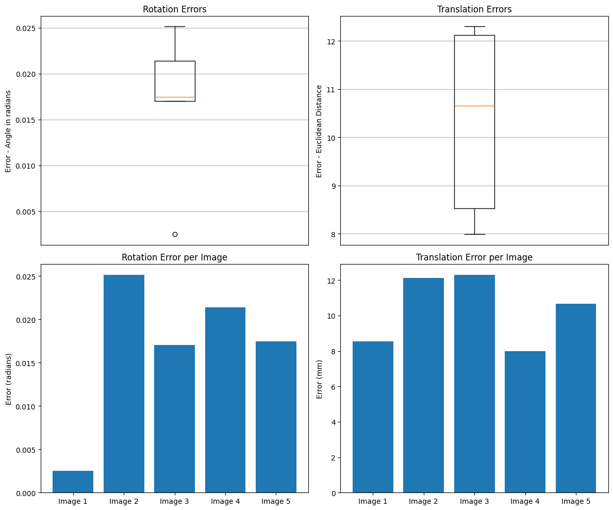

Now the Rotation Error is around $0.02rad = 1°$: this definitely confirm our hypothesis. As for the case of the Translation Error, we assess this last difference to the noise present in the estimation process.


*Clearly, keeping the change to the `get_homography` function means defining a world reference system in which the projected objects would grow away from the camera. We think that this definition is less intuitive, so we decide to restore `get_homography` to its initial version.*

## Task 6 - Our Own Calibration 

It is asked to calibrate a new camera and retrace the previous steps: in our case, our camera smartphone is used. Firstly, $30$ pictures of a $(11, 18)$ checkerboard are taken and then a copy of the previous code is created and executed. The images' dimensions are $4080\times3072$.

Since theory and implementation details are described above, here only the results are discussed. Let's break them down point by point:
1. **Zhang's Calibration method**

    The obtained matrix $K$ is:
    
    $$
        K = \begin{bmatrix} 
        \alpha_u = 3258.001 & \alpha_u cot(\theta) = 7.425 & u_0=2039.796 \\ 
        0 & \alpha_v / sin(\theta) = 3246.147 & v_0 = 1412.099 \\ 
        0 & 0 & 1 
        \end{bmatrix}
    $$

    The angle between the axis $u$ and $v$, represented by $\theta$, is approximately $90°$, thus we can consider the axes $u$ and $v$ to be perpendicular. The pricipal point $(u_0, v_0)$ is vertically shifted with respect to the expected one in an ideal camera, which in our case would be $(\frac{4080}{2}=2040, \frac{3072}{2} = 1536)$. Since $\alpha_u \approx \alpha_v$, the sensor pixel shape can be assumed to be a square. Even if the presence of misalignment between sensor and lenses may cause it, it is also important to notice that in modern smartphones the image captured by the sensor is not the one shown to the user. In fact, post-processing is generally applied, including image cropping, which may also explain the notable difference in the vertical coordinate.

2. **Total Reprojection Error**
   
    [TODO: data updated, so check the comment]
    The total reprojection error obtained is $1185.65$, with a mean error per corner equal to $6.97$. Even if these values are extremely higher with respect to the one previously obtained in the project (respectively $23.44$ and $0.01$), it is important to notice that the different pixel density present in the two analysed images can influence the perception of the error. In fact, the same pixel error is more evident in the image with lower pixel density.

    To perform a fair comparison, the following normalized error is computed:

    $$
    normalized\_error = \frac{\sqrt{\sum_i \left(\frac{u_i - \hat u_i}{width}\right)^2 + \left(\frac{v_i - \hat v_i}{height}\right)^2}}{n\_corners}
    $$

    where:
    - $(\hat u_i,\hat v_i)$ are the coordinates of the projected corner;
    - $(u_i, v_i)$ are the ground truth coordinates of the corner;
    - $(width, height)$ are the dimensions of the image;
    - $n\_corners$ is the number of projected corners.

    In this way, each error is weighted by the respective dimension of the image, obtaining an adimensional value:
    - Old images: $0.0010$;
    - New images: $0.0009$.

    *(The error is computed by collectively considering all corners across the images, e.g. $8 \times 11 \times 81 = 7128$ corners for the old images and $10 \times 17 \times 30 = 5100$ for the new ones.)*
  
    The error is basically the same. Here is an example of the corners projection:

    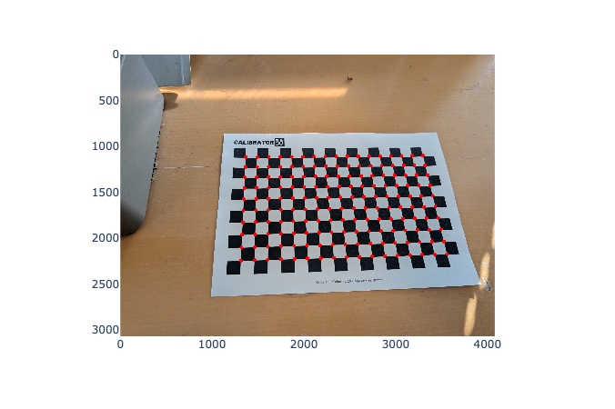

3. **Superimposing a cylinder**

    The projection of the cylinder appears as expected in all the 25 images. An example is shown:

    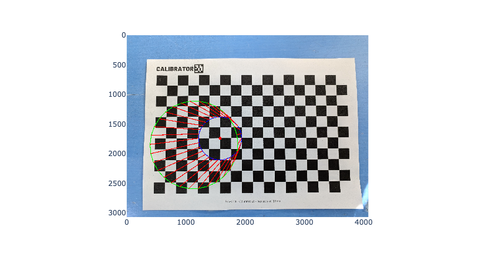

4. **Standard deviation of principal point**

    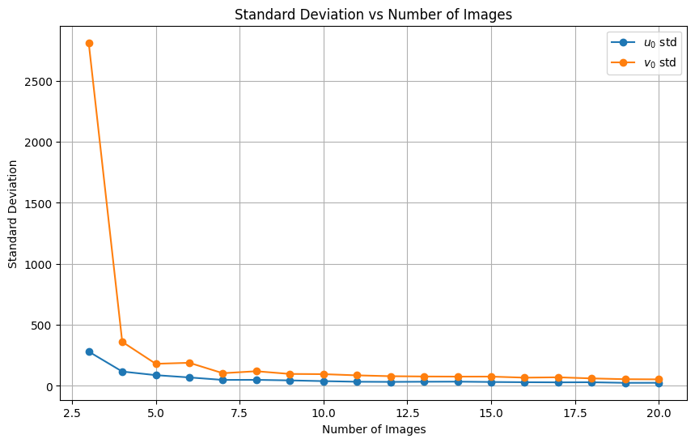

    As the number of images increases, the error decreases and reaches a plateu. The magnitude is significantly higher than the one previosuly observed in the project. In this sense, the analysis proposed in point 2 is still considered valid.

5. **Comparing the estimated $R,t$ pairs**

    Since no ground truth is available for our images, this point is not performed.

## Task 7 - Minimize Reprojection Error via MLE

In this exercise we are asked to refine our estimations by minimising the reprojection error using the Maximum Likelihood Estimation. In fact, by following the approach described by Zhang, we are no longer simply minimising the algebraic error used in the closed-form calibration method, but we are instead minimising the sum of squared reprojection errors, which is equivalent to maximising the likelihood of the observed data.  
It is important to note that the reprojection error measures the difference between the observed image points, which are extracted from the checkerboard images, and the projected image points obtained by projecting the known 3D checkerboard corners onto the image plane using the estimated camera parameters (and therefore the estimated projection matrix).

By following Zhang procedure, we know that the maximum likelihood estimate can be obtained by minimising the following functional: 

$$\sum_{i = 1}^n\sum_{j = 1}^m ||m_{ij} - \hat m(A, R_i, t_i, M_j)||^2$$

where $\hat m(A, R_i, t_i, M_j)$ is the projection of point $M_j$ in image $i$.
Thus, the optimisation minimises the sum of squared errors over all images and points: $\min_\theta \sum_{i, j}||m_{ij} - \hat m(A, R_i, t_i, M_j)||^2$, where $\theta$ is the full parameter vector: 
$$\theta = \{\alpha_u, \gamma, u_0, \alpha_v, v_0, r_1, \ldots, r_n, t_1, \ldots, t_n \}$$
where:
- $K = \begin{bmatrix} \alpha_u & \gamma & u_0 \\ 0 & \alpha_v & v_0 \\ 0 & 0 & 1 \end{bmatrix}$ 
- $\bold{r}_i$ is the rotation vector in axis-angle (Rodrigues) form of the $i^{th}$ image, $i \in \{1, \ldots, n \}$
- $\bold{t}_i$ is the translation vector of the $i^{th}$ image, $i \in \{1, \ldots, n \}$

In order to minimise our objective, we used, as suggested, the Lebenberg-Marquardt algorithm, which is conveniently implemented in the `scipy.optimize` package. Rotations are converted between matrix and axis-angle representations using Rodrigues' formula, which was implemented from scratch in the `get_rot_axis_from_R` and `get_R_from_axis` functions. So, all we did was applying the least-squares method while minimising the residuals in order to obtain the refined parameters.

After convergence, the reprojection error was evaluated, as usual, on `rgb_1.png`:
- **Total Reprojection Error:** 10.12
- **Mean Error per Corner:** 0.11

[TODO: data updated, so check the comment]
Comparing these results with the ones obtained in the Exercise 3, we can see a clear improvement: we reduced the total error from 23.44 to 10.12 and the mean error per corner from 0.27 to 0.11. We can therefore conclude that this process worked well, and it refined all the parameters of the camera, both the extrinsic and the intrinsic ones.

## Task 8 - Radial Distortion Compensation

In this task, we had to take into consideration the radial distortion, which is the phenomenon where straight lines appear curved in an image (especially at the periphery of the image), caused by light bending more at the lens edges than the center, making pixels shift radially inward or outward. By explicitly modeling radial lens distortion, we can compensate for it, thus making the model more accurate.

As seen in the Professor's notes, we based our procedure on the two parameter, $k_1$ and $k_2$, radial distortion model: 

$$\begin{cases} \hat{u} = (u - u_0)(1 + k_1r_d^2 + k_2r_d^4) + u_0 \\ \hat{v} = (v - v_0)(1 + k_1r_d^2 + k_2r_d^4) + v_0 \end{cases}$$

where $u, v$ are the ideal projections (in absence of radial distortion), $\hat u, \hat v$ are the actual projections and 

$$r_d^2 = \left(\frac{u - u_0}{\alpha_u}\right)^2 + \left(\frac{v - v_0}{\alpha_v}\right)^2$$

The procedure starts by basically following the approach seen in task one: we do not consider distortion and so we estimate our parameters via homographies. This provides an initial estimate of the camera parameters under the ideal pinhole assumption.  
Given the estimated intrinsic matrix $K$ and projection matrices $P_i$, the distortion coefficients $k_1$ and $k_2$ are estimated by solving a linear least-squares problem: for each image, we append the equation system, thus obtaining an overdetermined system: 

$$A \begin{bmatrix} k_1 \\ k_2 \end{bmatrix} = b$$

After estimating all the initial parameters, $K^0, R_i^0, t_i^0, P_i^0 \text{ and } k_1^0, k_2^0$, we had to refine them. To do so, we applied again the Levenberg-Marquardt algorithm to perform a non-linear reprojection error minimisation. The optimised parameters vector included the intrinsic parameters ($\alpha_u, \alpha_v, u_0, v_0$), the radial distortion coefficients ($k_1, k_2$), the rotation and the translation vectors for each image (the rotation vectors were obtained via the Rodrigues' formula). Again, minimising the sum of squared residuals corresponds to a Maximum Likelihood Estimation of all camera parameters, which, if we re-used Zhang's notation, would be:

$$\sum_{i = 1}^n \sum_{j = 1}^m ||m_{ij} - \hat m(A, k_1, k_2, R_i, t_i, M_j)||^2$$

It is important to note that in this case the intrinsic parameter $\gamma$ was set to 0, so it was not optimised during the procedure.

The analysis of the results using this model will be covered in the following exercise.

## Task 9 - Total Reprojection Error w/ & w/o Radial Distortion Compensation

The purpose of the last exercise is to quantitatively evaluate the impact of radial distortion compensation. To do so, we compared the total and mean reprojection errors of the standard pinhole camera model, with no distortion, and of the radial distortion-aware model. The first model was obviously based on the parameters estimated using Zhang's method, where radial distortion was not considered, whereas the second model was based on the parameters obtained and refined in Exercise 8.

For each observed corner $(u_{obs}, v_{obs})$ and corresponding projected point $(u_{proj}, v_{proj})$, the reprojection error is computed as the squared Euclidean distance in pixel space: 

$$err = (u_{obs} - u_{proj})^2 + (v_{obs} - v_{proj})^2$$

The total reprojection error is obtained by summing the error over all points and images, while the mean reprojection error is normalised by the total number of corners.

**Results:**
- Model without radial distortion:
  - Total Error: 8385.83
  - Mean Error: 0.834
- Model with radial distortion:
  - Total Error: 167.63
  - Mean Error: 0.024

[TODO: data updated, so check the comment]
The mean reprojection error is reduced by more than a factor of 6, from approximately 0.83 px to 0.02 px. The total reprojection error, on the other hand, decreases by over 80%, indicating a substantial improvement.

To conclude, we can see how effective radial distortion compensation in camera calibration is: while Zhang's initial estimates are valid, ignoring lens distortion leads to significant residual errors. By taking it into consideration, and refining all variables through reprojection error minimisation, we achieved far better and more accurate results, and consequently a more realistic camera model.

# Appendix

**AI Use:**
- Writing the documentation of the functions in the code;
- Writing Assertion Errors

# References

- Zhang, Zhengyou. A Flexible New Technique for Camera Calibration a Flexible New Technique for Camera Calibration. Vol. 10, 1999, www.microsoft.com/en-us/research/wp-content/uploads/2016/02/tr98-71.pdf.
- Wikipedia Contributors. “Axis–Angle Representation.” Wikipedia, Wikimedia Foundation, 8 May 2020, https://en.wikipedia.org/wiki/Axis%E2%80%93angle_representation
